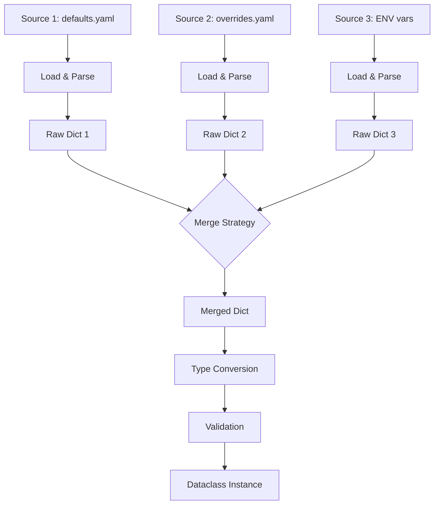

# Merge Rules

## How Merging Works



## Per-Field Merge Strategies

Override the global strategy for individual fields using `field_merges`.

All available `FieldMergeStrategy` values:

| Strategy | Behavior |
|----------|----------|
| `FIRST_WINS` | Keep the value from the first source |
| `LAST_WINS` | Keep the value from the last source |
| `APPEND` | Concatenate lists: `base + override` |
| `APPEND_UNIQUE` | Concatenate lists, removing duplicates |
| `PREPEND` | Concatenate lists: `override + base` |
| `PREPEND_UNIQUE` | Concatenate lists in reverse order, removing duplicates |

Given two sources with overlapping `tags`:

=== "merging_field_base.yaml"

    ```yaml
    --8<-- "examples/docs/advanced/merge_rules/sources/merging_field_base.yaml"
    ```

=== "merging_field_override.yaml"

    ```yaml
    --8<-- "examples/docs/advanced/merge_rules/sources/merging_field_override.yaml"
    ```

Each strategy produces a different result:

=== "FIRST_WINS"

    ```python
    --8<-- "examples/docs/advanced/merge_rules/merging_field_first_wins.py"
    ```

=== "LAST_WINS"

    ```python
    --8<-- "examples/docs/advanced/merge_rules/merging_field_last_wins.py"
    ```

=== "APPEND"

    ```python
    --8<-- "examples/docs/advanced/merge_rules/merging_field_append.py"
    ```

=== "APPEND_UNIQUE"

    ```python
    --8<-- "examples/docs/advanced/merge_rules/merging_field_append_unique.py"
    ```

=== "PREPEND"

    ```python
    --8<-- "examples/docs/advanced/merge_rules/merging_field_prepend.py"
    ```

=== "PREPEND_UNIQUE"

    ```python
    --8<-- "examples/docs/advanced/merge_rules/merging_field_prepend_unique.py"
    ```

Nested fields are supported: `F[Config].database.host`.

Per-field strategies work with `RAISE_ON_CONFLICT` — fields with an explicit strategy are excluded from conflict detection.

## With RAISE_ON_CONFLICT

Fields with an explicit strategy are excluded from conflict detection:

=== "Python"

    ```python
    --8<-- "examples/docs/advanced/merge_rules/advanced_merge_rules_conflict.py"
    ```

=== "common_defaults.yaml"

    ```yaml
    --8<-- "examples/docs/shared/common_defaults.yaml"
    ```

=== "common_overrides.yaml"

    ```yaml
    --8<-- "examples/docs/shared/common_overrides.yaml"
    ```

## Callable Merge

You can also pass a callable as the strategy:

=== "Python"

    ```python
    --8<-- "examples/docs/advanced/merge_rules/advanced_merge_rules_callable.py"
    ```

=== "common_defaults.yaml"

    ```yaml
    --8<-- "examples/docs/shared/common_defaults.yaml"
    ```

=== "common_overrides.yaml"

    ```yaml
    --8<-- "examples/docs/shared/common_overrides.yaml"
    ```

The callable receives a `list[JSONValue]` (one value per source) and returns the merged value.

## Field Groups

Ensure that related fields are always overridden together. If a source changes some fields in a group but not others, `FieldGroupError` is raised:

=== "Python"

    ```python
    --8<-- "examples/docs/advanced/merge_rules/merging_field_groups.py"
    ```

=== "common_field_groups_defaults.yaml"

    ```yaml
    --8<-- "examples/docs/shared/common_field_groups_defaults.yaml"
    ```

=== "common_field_groups_overrides.yaml"

    ```yaml
    --8<-- "examples/docs/shared/common_field_groups_overrides.yaml"
    ```

If `overrides.yaml` changes `host` and `port` together, the group constraint is satisfied. If it changed only `host` but not `port`, loading would fail:

```
Config field group errors (1)

  Field group (host, port) partially overridden in source 1
    changed:   host (from source yaml 'overrides.yaml')
    unchanged: port (from source yaml 'defaults.yaml')
```

For nested dataclass expansion and multiple groups, see [Field Groups](field-groups.md).

## Skipping Broken Sources

Skip sources that fail to load (missing file, invalid syntax):

=== "Python"

    ```python
    --8<-- "examples/docs/advanced/merge_rules/merging_skip_broken.py"
    ```

=== "common_defaults.yaml"

    ```yaml
    --8<-- "examples/docs/shared/common_defaults.yaml"
    ```

Override per source with `skip_if_broken` on `LoadMetadata` (takes priority over the global flag):

=== "Python"

    ```python
    --8<-- "examples/docs/advanced/merge_rules/merging_skip_broken_per_source.py"
    ```

=== "common_defaults.yaml"

    ```yaml
    --8<-- "examples/docs/shared/common_defaults.yaml"
    ```

If all sources fail to load, a `ValueError` is raised.

## Skipping Invalid Fields

Drop fields with invalid values and let other sources or defaults fill them in:

=== "Python"

    ```python
    --8<-- "examples/docs/advanced/merge_rules/merging_skip_invalid.py"
    ```

=== "merging_skip_invalid_defaults.yaml"

    ```yaml
    --8<-- "examples/docs/advanced/merge_rules/sources/merging_skip_invalid_defaults.yaml"
    ```

Restrict skipping to specific fields:

=== "Python"

    ```python
    --8<-- "examples/docs/advanced/merge_rules/merging_skip_invalid_per_field.py"
    ```

=== "merging_skip_invalid_per_field_defaults.yaml"

    ```yaml
    --8<-- "examples/docs/advanced/merge_rules/sources/merging_skip_invalid_per_field_defaults.yaml"
    ```

=== "merging_skip_invalid_per_field_overrides.yaml"

    ```yaml
    --8<-- "examples/docs/advanced/merge_rules/sources/merging_skip_invalid_per_field_overrides.yaml"
    ```

Only `port` and `timeout` will be skipped if invalid; other fields still raise errors.

If a required field is invalid in all sources and has no default:

```
Config loading errors (1)

  [port]  Missing required field (invalid in: yaml 'defaults.yaml', yaml 'overrides.yaml')
   └── FILE 'defaults.yaml', line 3
       port: "not_a_number"
   └── FILE 'overrides.yaml', line 2
       port: "not_a_number_too"
```
