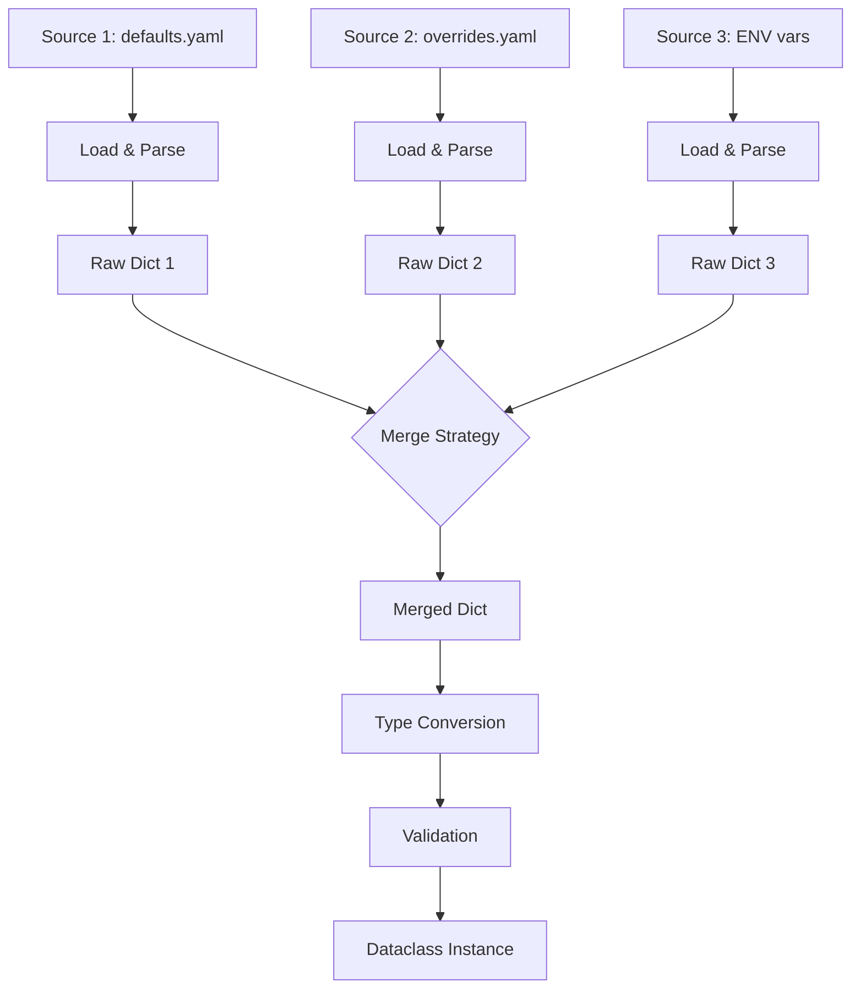

# Merge Rules

## How Merging Works



## Per-Field Merge Strategies

Override the global strategy for individual fields using `field_merges`. Each value can be one of the built-in strategy names below, or any [callable or custom class](#custom-field-strategy) implementing `FieldMergeStrategy`.

Available field merge strategies:

| Strategy | Behavior |
|----------|----------|
| `"first_wins"` | Keep the value from the first source |
| `"last_wins"` | Keep the value from the last source |
| `"append"` | Concatenate lists: `base + override` |
| `"append_unique"` | Concatenate lists, removing duplicates |
| `"prepend"` | Concatenate lists: `override + base` |
| `"prepend_unique"` | Concatenate lists in reverse order, removing duplicates |

Given two sources with overlapping `tags`:

=== "merging_field_base.yaml"

    ```yaml
    --8<-- "examples/docs/advanced/merge_rules/sources/merging_field_base.yaml"
    ```

=== "merging_field_override.yaml"

    ```yaml
    --8<-- "examples/docs/advanced/merge_rules/sources/merging_field_override.yaml"
    ```

Each strategy produces a different result:

=== "first_wins"

    ```python
    --8<-- "examples/docs/advanced/merge_rules/merging_field_first_wins.py"
    ```

=== "last_wins"

    ```python
    --8<-- "examples/docs/advanced/merge_rules/merging_field_last_wins.py"
    ```

=== "append"

    ```python
    --8<-- "examples/docs/advanced/merge_rules/merging_field_append.py"
    ```

=== "append_unique"

    ```python
    --8<-- "examples/docs/advanced/merge_rules/merging_field_append_unique.py"
    ```

=== "prepend"

    ```python
    --8<-- "examples/docs/advanced/merge_rules/merging_field_prepend.py"
    ```

=== "prepend_unique"

    ```python
    --8<-- "examples/docs/advanced/merge_rules/merging_field_prepend_unique.py"
    ```

Nested fields are supported: `dature.F[Config].database.host`.

### With `raise_on_conflict`

Fields with an explicit strategy are excluded from conflict detection:

=== "Python"

    ```python
    --8<-- "examples/docs/advanced/merge_rules/advanced_merge_rules_conflict.py"
    ```

=== "common_defaults.yaml"

    ```yaml
    --8<-- "examples/docs/shared/common_defaults.yaml"
    ```

=== "common_overrides.yaml"

    ```yaml
    --8<-- "examples/docs/shared/common_overrides.yaml"
    ```

## Custom Field Strategy

### The `FieldMergeStrategy` Protocol

Any callable that takes a `list[JSONValue]` (one value per source) and returns the merged value satisfies the public `FieldMergeStrategy` `Protocol`:

```python
--8<-- "src/dature/strategies/field.py:field-merge-strategy"
```

The built-in field strategies are also exposed as classes from `dature.strategies.field`: `FieldFirstWins`, `FieldLastWins`, `FieldAppend`, `FieldAppendUnique`, `FieldPrepend`, `FieldPrependUnique`. They satisfy the same `Protocol`, so you can pass them directly to `field_merges` or compose them inside your own strategy.

### Examples

Pick a plain function for one-off logic, or a class for a named, reusable reducer:

=== "Function"

    ```python
    --8<-- "examples/docs/advanced/merge_rules/advanced_merge_rules_callable.py"
    ```

=== "Class"

    ```python
    --8<-- "examples/docs/advanced/merge_rules/advanced_merge_rules_custom_field.py"
    ```

=== "common_defaults.yaml"

    ```yaml
    --8<-- "examples/docs/shared/common_defaults.yaml"
    ```

=== "common_overrides.yaml"

    ```yaml
    --8<-- "examples/docs/shared/common_overrides.yaml"
    ```

## Custom Source Strategy

The global `strategy` parameter accepts not only the names from [Merge Strategies](../features/merging.md#merge-strategies) but also any object implementing the public `SourceMergeStrategy` `Protocol`:

```python
class SourceMergeStrategy(Protocol):
    def __call__(self, sources: Sequence[Source], ctx: LoadCtx) -> JSONValue: ...
```

The strategy receives the raw `Source` instances (not pre-loaded data) and a `LoadCtx` helper. The primary API for applying a source to the running base is `ctx.merge(source=src, base=base, op=...)` — it loads the source (cached), runs the merge `op` (default `deep_merge_last_wins`), and registers the step so debug logs and `LoadReport.field_origins` are populated correctly. A minimal custom strategy is one loop:

```python
class MyCustom:
    def __call__(self, sources, ctx):
        base = {}
        for src in sources:
            base = ctx.merge(source=src, base=base)
        return base
```

Override `op` to plug in your own merge function — e.g. shallow overlay for env on top of files:

=== "Python"

    ```python
    --8<-- "examples/docs/advanced/merge_rules/advanced_merge_rules_custom_source.py"
    ```

=== "common_defaults.yaml"

    ```yaml
    --8<-- "examples/docs/shared/common_defaults.yaml"
    ```

=== "common_overrides.yaml"

    ```yaml
    --8<-- "examples/docs/shared/common_overrides.yaml"
    ```

`isinstance(src, EnvSource)` (or any other concrete `Source` subclass) lets the strategy dispatch on source type — useful when env variables should override file content rather than merge with it. Pass `skip_on_error=True` to `ctx.merge(...)` (or `ctx.load(...)`) if you want broken sources to be skipped silently regardless of `skip_if_broken` (this is what `SourceFirstFound` does internally).

`ctx.merge` is the single hook — once your strategy funnels every per-source step through it, debug logs (`[Cls] Merge step N ...`, `State after step N: ...`) and `LoadReport.field_origins` are populated automatically; there's no separate registration call to remember.

## Skipping Broken Sources

Skip sources that fail to load (missing file, invalid syntax):

=== "Python"

    ```python
    --8<-- "examples/docs/advanced/merge_rules/merging_skip_broken.py"
    ```

=== "common_defaults.yaml"

    ```yaml
    --8<-- "examples/docs/shared/common_defaults.yaml"
    ```

Override per source with `skip_if_broken` on `Source` (takes priority over the global flag):

=== "Python"

    ```python
    --8<-- "examples/docs/advanced/merge_rules/merging_skip_broken_per_source.py"
    ```

=== "common_defaults.yaml"

    ```yaml
    --8<-- "examples/docs/shared/common_defaults.yaml"
    ```

If all sources fail to load, a `ValueError` is raised.

## Skipping Invalid Fields

Drop fields with invalid values and let other sources or defaults fill them in:

=== "Python"

    ```python
    --8<-- "examples/docs/advanced/merge_rules/merging_skip_invalid.py"
    ```

=== "merging_skip_invalid_defaults.yaml"

    ```yaml
    --8<-- "examples/docs/advanced/merge_rules/sources/merging_skip_invalid_defaults.yaml"
    ```

Restrict skipping to specific fields:

=== "Python"

    ```python
    --8<-- "examples/docs/advanced/merge_rules/merging_skip_invalid_per_field.py"
    ```

=== "merging_skip_invalid_per_field_defaults.yaml"

    ```yaml
    --8<-- "examples/docs/advanced/merge_rules/sources/merging_skip_invalid_per_field_defaults.yaml"
    ```

=== "merging_skip_invalid_per_field_overrides.yaml"

    ```yaml
    --8<-- "examples/docs/advanced/merge_rules/sources/merging_skip_invalid_per_field_overrides.yaml"
    ```

Only `port` and `timeout` will be skipped if invalid; other fields still raise errors.

If a required field is invalid in all sources and has no default:

```
Config loading errors (1)

  [port]  Missing required field (invalid in: yaml 'defaults.yaml', yaml 'overrides.yaml')
   └── FILE 'defaults.yaml', line 3
       port: "not_a_number"
   └── FILE 'overrides.yaml', line 2
       port: "not_a_number_too"
```
