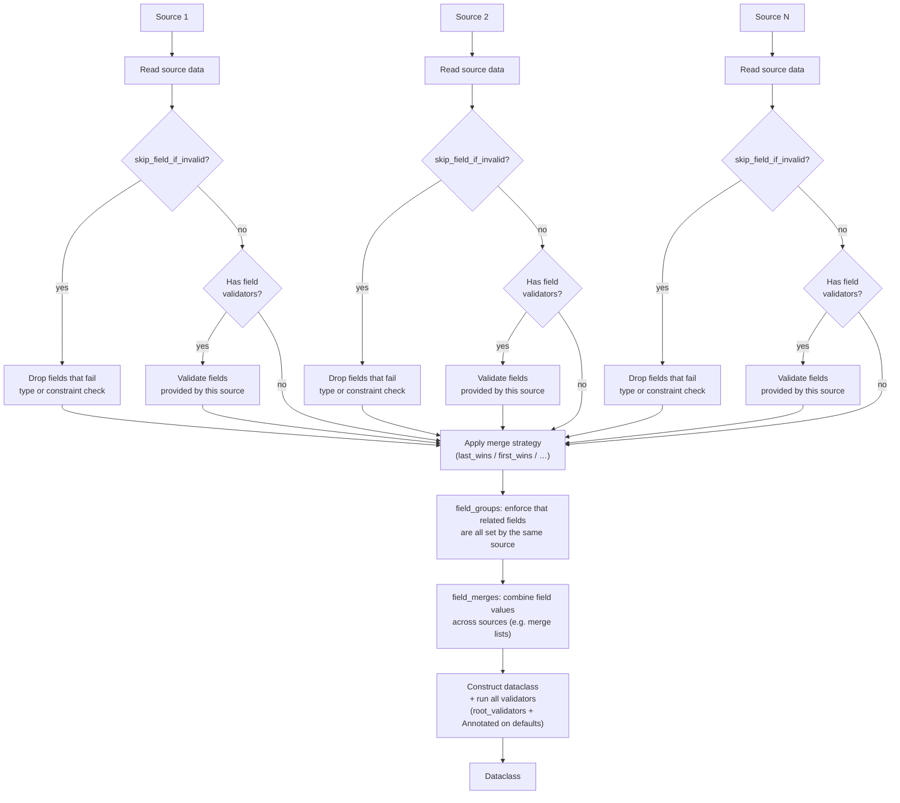

# Merging

## How Merging Works



When your config is spread across several sources — defaults in a file, overrides from the
environment, and so on — dature loads each source independently, layers them by priority, and
produces one validated instance. Crucially, **each source is validated on its own
contribution**, so an override only needs to be valid for the fields it actually sets.

1. **Load and validate each source independently.** Every source is read (with `expand_env_vars`
   substitution and `masking_mode` / `secret_field_names` masking). If `skip_field_if_invalid`
   is on, invalid values are dropped per source before field validation. Then each source's own
   values are coerced and run through field-level validation — type coercion, `Annotated`
   constraints, source-level `validators=`. A source is judged only on the fields it provides,
   never on the merged whole. Missing or broken sources can be tolerated with `skip_if_missing`
   / `skip_if_broken`; `first_found` tolerates them automatically.
2. **Layer the sources together** (`strategy`). Sources are merged by the chosen strategy:
   `last_wins` (default — later sources override earlier), `first_wins` (earlier sources win),
   `first_found` (take the first that loads, ignore the rest), or `raise_on_conflict` (error
   if two sources disagree on a value). Nested sections merge key-by-key; lists and scalars are
   replaced wholesale according to the strategy.
3. **Apply cross-source rules.** `field_groups=` enforce that related fields are always
   overridden together — never half from one source, half from another. `field_merges=` apply
   per-field aggregation (e.g. concatenating lists or picking the max) instead of a plain
   last/first-wins replacement.
4. **Construct and validate dataclass.** The merged values are assembled into the instance.
   `root_validators=` run once on the finished object — checks that span several fields at once
   (e.g. "start must be before end"). Fields no source supplied take their dataclass defaults;
   any `Annotated` constraints on those defaults are still enforced.
5. **Result.** One typed, validated config — or a report of every problem, each tied to the
   source it came from.

Steps 4–5 are identical to [single-source loading](../loading.md): multi-source is just
single-source with a per-source load-and-validate step and a merge step in front. One source
is the N=1 case.

## Basic Merging

Pass multiple `Source` objects to `dature.load()`:

=== "Python"

    ```python
    --8<-- "docs/examples/basic/merging/merging_basic.py:example"
    ```

=== "common_defaults.yaml"

    ```yaml
    --8<-- "docs/examples/shared/common_defaults.yaml"
    ```

=== "common_overrides.yaml"

    ```yaml
    --8<-- "docs/examples/shared/common_overrides.yaml"
    ```

## Multiple Sources

Multiple sources use `"last_wins"` by default:

=== "Python"

    ```python
    --8<-- "docs/examples/basic/merging/merging_tuple_shorthand.py:example"
    ```

=== "common_defaults.yaml"

    ```yaml
    --8<-- "docs/examples/shared/common_defaults.yaml"
    ```

=== "common_overrides.yaml"

    ```yaml
    --8<-- "docs/examples/shared/common_overrides.yaml"
    ```

The decorator also uses `"last_wins"``:

=== "Python"

    ```python
    --8<-- "docs/examples/basic/merging/merging_tuple_shorthand_decorator.py:example"
    ```

=== "common_defaults.yaml"

    ```yaml
    --8<-- "docs/examples/shared/common_defaults.yaml"
    ```

## Merge Strategies

| Strategy | Behavior |
|----------|----------|
| `"last_wins"` | Last source overrides (default) |
| `"first_wins"` | First source wins |
| `"first_found"` | Uses the first source that loads successfully, skips broken sources automatically |
| `"raise_on_conflict"` | Raises `MergeConflictError` if the same key appears in multiple sources with different values |

Nested dicts are merged recursively. Lists and scalars are replaced entirely according to the strategy.

=== "last_wins"

    Last source overrides earlier ones. This is the default strategy.

    ```python
    --8<-- "docs/examples/basic/merging/merging_strategy_last_wins.py:example"
    ```

    === "common_defaults.yaml"

        ```yaml
        --8<-- "docs/examples/shared/common_defaults.yaml"
        ```

    === "common_overrides.yaml"

        ```yaml
        --8<-- "docs/examples/shared/common_overrides.yaml"
        ```

=== "first_wins"

    First source wins on conflict. Later sources only fill in missing keys.

    ```python
    --8<-- "docs/examples/basic/merging/merging_strategy_first_wins.py:example"
    ```

    === "common_defaults.yaml"

        ```yaml
        --8<-- "docs/examples/shared/common_defaults.yaml"
        ```

    === "common_overrides.yaml"

        ```yaml
        --8<-- "docs/examples/shared/common_overrides.yaml"
        ```

=== "first_found"

    Uses the first source that loads successfully and ignores the rest. Broken sources (missing file, parse error) are skipped automatically — no `skip_if_broken` needed. Type errors (wrong type, missing field) are **not** skipped.

    ```python
    --8<-- "docs/examples/basic/merging/merging_strategy_first_found.py:example"
    ```

    === "common_defaults.yaml"

        ```yaml
        --8<-- "docs/examples/shared/common_defaults.yaml"
        ```

=== "raise_on_conflict"

    Raises `MergeConflictError` if the same key appears in multiple sources with different values. Works best when sources have disjoint keys.

    ```python
    --8<-- "docs/examples/basic/merging/merging_strategy_raise_on_conflict.py:example"
    ```

    === "common_raise_on_conflict_a.yaml"

        ```yaml
        --8<-- "docs/examples/shared/common_raise_on_conflict_a.yaml"
        ```

    === "common_raise_on_conflict_b.yaml"

        ```yaml
        --8<-- "docs/examples/shared/common_raise_on_conflict_b.yaml"
        ```

`strategy` is not limited to the names above — any object implementing the `SourceMergeStrategy` `Protocol` is accepted, so you can plug in your own merge logic (e.g. let env sources override files unconditionally) while still composing the built-in strategies. See [Custom Source Strategy](../advanced/merge-strategies.md#custom-source-strategy).

For per-field strategy overrides, see [Per-Field Merge Strategies](../advanced/merge-strategies.md#per-field-merge-strategies). To enforce that related fields are always overridden together, see [Field Groups](../advanced/field-groups.md).

## Merge Parameters

All merge-related parameters are passed directly to `dature.load()` as keyword arguments:

| Parameter | Description |
|-----------|-------------|
| `strategy` | Global merge strategy. Default: `"last_wins"`. See [Merge Strategies](#merge-strategies) |
| `field_merges` | Per-field merge strategy overrides. See [Per-Field Merge Strategies](../advanced/merge-strategies.md#per-field-merge-strategies) |
| `field_groups` | Enforce related fields are overridden together. See [Field Groups](../advanced/field-groups.md) |
| `skip_if_broken` | Skip sources that fail to parse (invalid syntax, config error). See [Skipping Sources with Parse Errors](../advanced/skip-behaviors.md#skipping-sources-with-parse-errors) |
| `skip_if_missing` | Skip sources whose file does not exist. See [Skipping Missing Sources](../advanced/skip-behaviors.md#skipping-missing-sources) |
| `skip_field_if_invalid` | Drop fields with invalid values. See [Skipping Invalid Fields](../advanced/skip-behaviors.md#skipping-invalid-fields) |
| `expand_env_vars` | ENV variable expansion mode. See [ENV Expansion](../advanced/env-expansion.md) |
| `secret_field_names` | Extra secret name patterns for masking. See [Masking](masking.md) |
| `masking_mode` | Masking mode for all sources: `"all"`, `"secrets_only"`, or `"none"`. See [Masking](masking.md) |
| `nested_resolve_strategy` | Default priority when both JSON and flat keys exist: `"flat"` (default) or `"json"`. Applies to all sources. See [Nested Resolve](../advanced/nested-resolve.md) |
| `nested_resolve` | Default per-field strategy overrides for all sources. See [Nested Resolve](../advanced/nested-resolve.md#per-field-strategy) |
