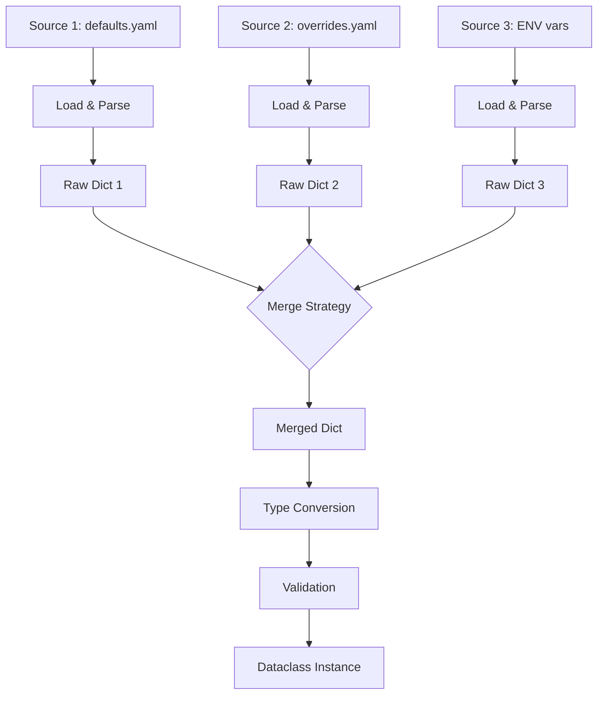

# Merging

Load configuration from multiple sources and merge them into one dataclass.

## Basic Merging

Use `MergeMetadata` to combine sources:

=== "Python"

    ```python
    --8<-- "examples/docs/merging_basic.py"
    ```

=== "defaults.yaml"

    ```yaml
    --8<-- "examples/docs/sources/defaults.yaml"
    ```

=== "overrides.yaml"

    ```yaml
    --8<-- "examples/docs/sources/overrides.yaml"
    ```

## Tuple Shorthand

Pass a tuple of `LoadMetadata` directly — uses `LAST_WINS` by default:

=== "Python"

    ```python
    --8<-- "examples/docs/merging_tuple_shorthand.py"
    ```

=== "defaults.yaml"

    ```yaml
    --8<-- "examples/docs/sources/defaults.yaml"
    ```

=== "overrides.yaml"

    ```yaml
    --8<-- "examples/docs/sources/overrides.yaml"
    ```

Works as a decorator too:

=== "Python"

    ```python
    --8<-- "examples/docs/merging_tuple_shorthand_decorator.py"
    ```

=== "defaults.yaml"

    ```yaml
    --8<-- "examples/docs/sources/defaults.yaml"
    ```

## Merge Strategies

=== "Python"

    ```python
    --8<-- "examples/docs/merging_strategies.py"
    ```

=== "defaults.yaml"

    ```yaml
    --8<-- "examples/docs/sources/defaults.yaml"
    ```

=== "overrides.yaml"

    ```yaml
    --8<-- "examples/docs/sources/overrides.yaml"
    ```

| Strategy | Behavior |
|----------|----------|
| `LAST_WINS` | Last source overrides (default) |
| `FIRST_WINS` | First source wins |
| `RAISE_ON_CONFLICT` | Raises `MergeConflictError` if the same key appears in multiple sources with different values |

Nested dicts are merged recursively. Lists and scalars are replaced entirely according to the strategy.

### How Merging Works



## Per-Field Merge Strategies

Override the global strategy for individual fields using `field_merges`:

=== "Python"

    ```python
    --8<-- "examples/docs/merging_field_merges.py"
    ```

=== "defaults.yaml"

    ```yaml
    --8<-- "examples/docs/sources/defaults.yaml"
    ```

=== "overrides.yaml"

    ```yaml
    --8<-- "examples/docs/sources/overrides.yaml"
    ```

| Strategy | Behavior |
|----------|----------|
| `FIRST_WINS` | Keep the value from the first source |
| `LAST_WINS` | Keep the value from the last source |
| `APPEND` | Concatenate lists: `base + override` |
| `APPEND_UNIQUE` | Concatenate lists, removing duplicates |
| `PREPEND` | Concatenate lists: `override + base` |
| `PREPEND_UNIQUE` | Concatenate lists in reverse order, removing duplicates |

Nested fields are supported: `F[Config].database.host`.

Per-field strategies work with `RAISE_ON_CONFLICT` — fields with an explicit strategy are excluded from conflict detection.

For more details, see [Advanced — Merge Rules](../advanced/merge-rules.md).

## Field Groups

Ensure that related fields are always overridden together. If a source changes some fields in a group but not others, `FieldGroupError` is raised:

=== "Python"

    ```python
    --8<-- "examples/docs/merging_field_groups.py"
    ```

=== "field_groups_defaults.yaml"

    ```yaml
    --8<-- "examples/docs/sources/field_groups_defaults.yaml"
    ```

=== "field_groups_overrides.yaml"

    ```yaml
    --8<-- "examples/docs/sources/field_groups_overrides.yaml"
    ```

If `overrides.yaml` changes `host` and `port` together, the group constraint is satisfied. If it changed only `host` but not `port`, loading would fail:

```
Config field group errors (1)

  Field group (host, port) partially overridden in source 1
    changed:   host (from source yaml 'overrides.yaml')
    unchanged: port (from source yaml 'defaults.yaml')
```

For nested dataclass expansion and multiple groups, see [Advanced — Field Groups](../advanced/field-groups.md).
