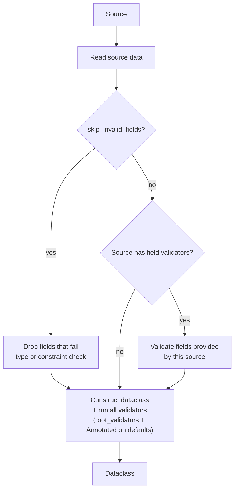

# Loading

## How Single-Source Loading Works



dature reads your config from a single source, converts every raw value into the type its
dataclass field declares, checks it against the rules you attached, and returns a ready,
fully-validated instance. Validation happens in distinct tiers; if anything fails, dature
gathers **every** error into one report naming the field, its location in the source, and why
it failed.

1. **Read the source.** Raw values are pulled from the source. With `expand_env_vars`,
   `${VAR}` placeholders are substituted first; secrets are masked in error/debug output per
   `mask_secrets` / `secret_field_names`.
2. **Optionally drop invalid values** (`skip_invalid_fields`). When enabled, each provided
   value is probed against its field's type and rules, and anything that would fail is quietly
   dropped so the field can fall back to its dataclass default instead of failing the whole
   load. The field-validator pass (step 3) is then skipped — remaining fields are counted as
   already checked. Without the flag, nothing is dropped and failures surface as errors.
3. **Field-level validation.** Every value the source provided is coerced to the field's type
   and checked against that field's declared rules: declared type, `Annotated` constraints
   (ranges, patterns, custom predicates), plus any per-source `validators=` attached to the
   source. Fields the source did not provide are left untouched here.
4. **Construct and validate dataclass.** Once the values are assembled into the instance,
   `root_validators=` run — checks that span several fields at once (e.g. "start must be
   before end"). Fields no source supplied take their dataclass default; any `Annotated`
   constraints on those defaults are still enforced.
5. **Result.** A fully typed, fully validated config instance — or a single grouped error
   report of every field that failed across all tiers at once.

For multi-source loading, see [Merging](basic/merging.md).

---

When a `dature.load(...)` call fails, the error message tells you which field
broke, where in the source it came from, and why. This page walks through the
failures you are most likely to hit while wiring up your first config — and one
pattern for recovering from them.

All examples share the same schema

## Source does not exist

Wrong path or wrong working directory — the most common first error. dature
raises a plain `FileNotFoundError` before any parsing happens.

=== "Python"

    ```python
    --8<-- "docs/examples/loading/loading_missing_file.py:example"
    ```

=== "Error"

    ```
    --8<-- "docs/examples/loading/loading_missing_file.stderr"
    ```

## Source exists but is broken

The file is present but the parser can't read it (here: invalid YAML
indentation). dature does not swallow parser errors — the underlying exception
propagates with the original file and line.

=== "Python"

    ```python
    --8<-- "docs/examples/loading/loading_broken_file.py:example"
    ```

=== "broken.yaml"

    ```yaml
    --8<-- "docs/examples/loading/sources/broken.yaml"
    ```

=== "Error"

    ```
    --8<-- "docs/examples/loading/loading_broken_file.stderr"
    ```

## Type mismatch

The source parses, but a value can't be coerced to the field's annotated type.
dature raises a `FieldLoadError` with the field path, the offending value, a
caret pointing at it, and the source location.

=== "Python"

    ```python
    --8<-- "docs/examples/loading/loading_type_mismatch.py:example"
    ```

=== "type_mismatch.yaml"

    ```yaml
    --8<-- "docs/examples/loading/sources/type_mismatch.yaml"
    ```

=== "Error"

    ```
    --8<-- "docs/examples/loading/loading_type_mismatch.stderr"
    ```

## Required field missing

A field with no default value is absent from the source. The error points at
the file but has no line — there is nothing in the source to highlight.

=== "Python"

    ```python
    --8<-- "docs/examples/loading/loading_missing_field.py:example"
    ```

=== "missing_field.yaml"

    ```yaml
    --8<-- "docs/examples/loading/sources/missing_field.yaml"
    ```

=== "Error"

    ```
    --8<-- "docs/examples/loading/loading_missing_field.stderr"
    ```

## Multiple errors at once

dature does not stop at the first error — it keeps going and reports every
failed field together as an `ExceptionGroup`. You fix the config in one pass
instead of "fix, rerun, fix, rerun".

=== "Python"

    ```python
    --8<-- "docs/examples/loading/loading_multiple_errors.py:example"
    ```

=== "multiple_errors.yaml"

    ```yaml
    --8<-- "docs/examples/loading/sources/multiple_errors.yaml"
    ```

=== "Error"

    ```
    --8<-- "docs/examples/loading/loading_multiple_errors.stderr"
    ```

## Recovering: skip an unavailable source

When merging multiple sources, an absent or malformed one can be skipped so the
next source supplies the values. Use `skip_if_missing=True` for files that may
not exist, or `skip_if_broken=True` for files that exist but may be malformed:

=== "Python"

    ```python
    --8<-- "docs/examples/loading/loading_skip_broken.py:example"
    ```

=== "fallback.yaml"

    ```yaml
    --8<-- "docs/examples/loading/sources/fallback.yaml"
    ```

If **every** source fails, dature still raises — there is no value to load.
See [Skipping Sources with Parse Errors](advanced/skip-behaviors.md#skipping-sources-with-parse-errors)
and [Skipping Missing Sources](advanced/skip-behaviors.md#skipping-missing-sources) for the full picture,
including per-source overrides and `skip_invalid_fields`.

