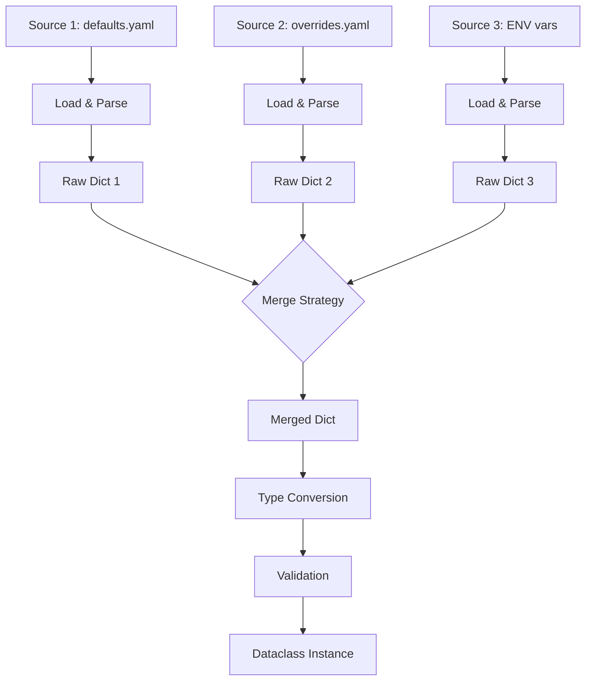

# Merging

Load configuration from multiple sources and merge them into one dataclass.

## Basic Merging

Use `MergeMetadata` to combine sources:

```python
--8<-- "examples/docs/merging_basic.py"
```

## Tuple Shorthand

Pass a tuple of `LoadMetadata` directly — uses `LAST_WINS` by default:

```python
--8<-- "examples/docs/merging_tuple_shorthand.py"
```

Works as a decorator too:

```python
@load((
    LoadMetadata(file_="defaults.yaml"),
    LoadMetadata(prefix="APP_"),
))
@dataclass
class Config:
    host: str
    port: int
```

## Merge Strategies

```python
--8<-- "examples/docs/merging_strategies.py"
```

| Strategy | Behavior |
|----------|----------|
| `LAST_WINS` | Last source overrides (default) |
| `FIRST_WINS` | First source wins |
| `RAISE_ON_CONFLICT` | Raises `MergeConflictError` if the same key appears in multiple sources with different values |

Nested dicts are merged recursively. Lists and scalars are replaced entirely according to the strategy.

### How Merging Works



## Per-Field Merge Strategies

Override the global strategy for individual fields using `field_merges`:

```python
--8<-- "examples/docs/merging_field_merges.py"
```

| Strategy | Behavior |
|----------|----------|
| `FIRST_WINS` | Keep the value from the first source |
| `LAST_WINS` | Keep the value from the last source |
| `APPEND` | Concatenate lists: `base + override` |
| `APPEND_UNIQUE` | Concatenate lists, removing duplicates |
| `PREPEND` | Concatenate lists: `override + base` |
| `PREPEND_UNIQUE` | Concatenate lists in reverse order, removing duplicates |

Nested fields are supported: `F[Config].database.host`.

Per-field strategies work with `RAISE_ON_CONFLICT` — fields with an explicit strategy are excluded from conflict detection.

For more details, see [Advanced — Per-Field Merge Rules](advanced.md#per-field-merge-rules).

## Field Groups

Ensure that related fields are always overridden together. If a source changes some fields in a group but not others, `FieldGroupError` is raised:

```python
--8<-- "examples/docs/merging_field_groups.py"
```

If `overrides.yaml` changes `host` and `port` together, the group constraint is satisfied. If it changed only `host` but not `port`, loading would fail:

```
Config field group errors (1)

  Field group (host, port) partially overridden in source 1
    changed:   host (from source yaml 'overrides.yaml')
    unchanged: port (from source yaml 'defaults.yaml')
```

For nested dataclass expansion and multiple groups, see [Advanced — Field Groups](advanced.md#field-groups).

## Skipping Broken Sources

Skip sources that fail to load (missing file, invalid syntax):

```python
--8<-- "examples/docs/merging_skip_broken.py"
```

Override per source with `skip_if_broken` on `LoadMetadata` (takes priority over the global flag):

```python
config = load(
    MergeMetadata(
        sources=(
            LoadMetadata(file_="defaults.yaml"),                       # uses global
            LoadMetadata(file_="optional.yaml", skip_if_broken=True),  # always skip if broken
            LoadMetadata(prefix="APP_", skip_if_broken=False),         # never skip
        ),
        skip_broken_sources=True,  # global default
    ),
    Config,
)
```

If all sources fail to load, a `ValueError` is raised.

## Skipping Invalid Fields

Drop fields with invalid values and let other sources or defaults fill them in:

```python
--8<-- "examples/docs/merging_skip_invalid.py"
```

Restrict skipping to specific fields:

```python
config = load(
    MergeMetadata(
        sources=(
            LoadMetadata(
                file_="overrides.yaml",
                skip_if_invalid=(F[Config].port, F[Config].timeout),
            ),
            LoadMetadata(file_="defaults.yaml"),
        ),
    ),
    Config,
)
```

Only `port` and `timeout` will be skipped if invalid; other fields still raise errors.

If a required field is invalid in all sources and has no default:

```
Config loading errors (1)

  [port]  Missing required field (invalid in: yaml 'defaults.yaml', yaml 'overrides.yaml')
   └── FILE 'overrides.yaml', line 1
       {"port": "abc"}
```
